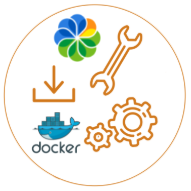

<div align="justify">

# Instalación de Alfresco a través de Docker-Compose y Docker.

<div align="center">
  
</div>

## PreRequesitos

La instalación de Alfresco a través de __docker__ requiere tener el siguiente software instalado en el servidor:
- __Java: OpenJDK 11 recomendada__.
- __Maven 3__.
- __Docker__.
- __Docker-Compose__.

## Descripción

Para realizar la instalación la instalación de __Alfresco__ a través de __Docker__, vamos a hacer uso de los arquetipos de __Maven__.Los pasos para la construcción serán:
- Lanza el siguiente comando maven:
  ```console
  mvn archetype:generate "-Dfilter=org.alfresco:"
  ```
- Obtendremos una imagen similar a la siguiente:
  ```console
  [INFO] Generating project in Interactive mode
  [INFO] No archetype defined. Using maven-archetype-quickstart (org.apache.maven.archetypes:maven-archetype-quickstart:1.0)
  Choose archetype:
  1: remote -> org.alfresco.maven.archetype:alfresco-platform-jar-archetype (Sample project with full support for lifecycle and rapid development of Platform/Repository JARs and AMPs (Alfresco Module Packages))
  2: remote -> org.alfresco.maven.archetype:alfresco-share-jar-archetype (Share project with full support for lifecycle and rapid development of JARs and AMPs (Alfresco Module
          Packages))
  3: remote -> org.alfresco.maven.archetype:alfresco-allinone-archetype (Sample multi-module project for All-in-One development on the Alfresco platform. Includes modules for Platform/Repository JAR and Share JAR)
  ...

  ```
- Seleccionamos la opción 3:
```console
3: remote -> org.alfresco.maven.archetype:alfresco-allinone-archetype
```
- A continuación debemos de seleccionar la versión de Alfresco a insertar. Si deseamos instalar la versión __6.x__ o superior, debemos de seleccionar la versión 4.0.0 o superior.
```console
 1: 2.0.0-beta-1
 2: 2.0.0-beta-2
 3: 2.0.0-beta-3
 4: 2.0.0-beta-4
 5: 2.0.0
 6: 2.1.0
 7: 2.1.1
 8: 2.2.0
 9: 3.0.0
 10: 3.0.1
 11: 4.0.0
 12: 4.1.0
 ..: ..
```
- Como proyecto __Maven__, el siguiente paso será definir:
  - groupId.
  - artifactId.
  - package.
- Tras seguir las indicaciones que se nos facilitan, se muestra un mensaje similar a:
```console
[INFO] ----------------------------------------------------------------------------
[INFO] Using following parameters for creating project from Archetype: alfresco-allinone-archetype:4.1.0-SNAPSHOT
[INFO] ----------------------------------------------------------------------------
[INFO] Parameter: groupId, Value: com.acme
[INFO] Parameter: artifactId, Value: my-all-in-one
[INFO] Parameter: version, Value: 1.0-SNAPSHOT
[INFO] Parameter: package, Value: com.acme
[INFO] Parameter: packageInPathFormat, Value: com/acme
[INFO] Parameter: package, Value: com.acme
[INFO] Parameter: groupId, Value: com.acme
[INFO] Parameter: artifactId, Value: my-all-in-one
[INFO] Parameter: version, Value: 1.0-SNAPSHOT
[INFO] Parent element not overwritten in /Users/Alfresco/my-all-in-one/my-all-in-one-platform/pom.xml
[INFO] Parent element not overwritten in /Users/Alfresco/my-all-in-one/my-all-in-one-share/pom.xml
[INFO] Parent element not overwritten in /Users/Alfresco/my-all-in-one/my-all-in-one-integration-tests/pom.xml
[INFO] Parent element not overwritten in /Users/Alfresco/my-all-in-one/my-all-in-one-platform-docker/pom.xml
[INFO] Parent element not overwritten in /Users/Alfresco/my-all-in-one/my-all-in-one-share-docker/pom.xml
[INFO] Executing META-INF/archetype-post-generate.groovy post-generation script
[INFO] Project created from Archetype in dir: /Users/Alfresco/my-all-in-one
[INFO] ------------------------------------------------------------------------
[INFO] BUILD SUCCESS
[INFO] ------------------------------------------------------------------------
```
- Finalización de la construcción del proyecto.

```console
  BUILD SUCCESS
```
- Arranque de Alfresco. Para arrancar tan sólo debemos de localizar el siguiente script:
 - __./run.sh build_start__ para __Mac OS X__ o __Linux__.
 - __run.bat build_start__ para __Windows__.
 - Cuando deseemos arrancar nuevamente el proyecto, se ha de sustituir __build_start__, por __start__.
 - Por último, indicar que si realizamos cambios en el módulo platform o share, debemos ejecutar __build_start__ para ver los cambios hechos efectivos.
- Verificación del arranque de Alfresco:

  <div align="left">

  Service	| Endpoint
  -- | --
  Administration and REST APIs | http://localhost:8080/alfresco
  Share	| http://localhost:8080/share
  Digital Workspace |	http://localhost:8080/workspace
  Search Services administration |	http://localhost:8083/solr
  Sync Service health check	| http://localhost:9090/alfresco/healthcheck

  </div>
- Credenciales:
 - Usuario: __admin__.
 - Password: __admin__.


## Referencias

- [Instalación de Alfresco con Docker](https://docs.alfresco.com/content-services/6.2/install/containers/docker-compose/).
- [Construcción de Alfresco a través de arquetipos](https://docs.alfresco.com/content-services/6.2/develop/sdk/#mvnarchetypes).

</div>
